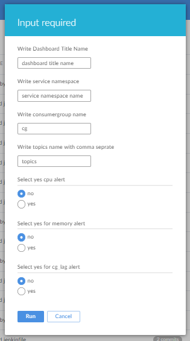

# grafana dashboard tempalate

## grafana-template-pod-metrics.json
- a generic template for all the infra and go process metrics of pods.
- it has variable filter with namespace,pods, and container

### Prior requirement
- create a source with name called "promethues"
- import grafana-template-pod-metrics.json file.

---------------------------------------------------------------------------------------------------------------------------------------------
# grafana dashboard generator
## automation component
  - grafanalib
  - jinja2
  - python

## How to generate dashboard json file for grafana.
  - visit [jenkin job](https://tooling.itsupport247.net/jenkins/blue/organizations/jenkins/grafana_dashboard_generator/activity) and click on Run button
  
  - then fill this input form 
   
   

### grafana_template.py
   - is a python template, which is responsible for generating a final python file for grafanalib.
   - it will consume multiple jinja2 templates (inside template/*.j2).
### template/main.txt.j2
   - is main jinja template which include several other jinja templates(pods_metrics.txt.j2,kafka_metrics.txt.j2 and go_metrics.txt.j2).
--------------------------------------------------------------------------------------------------------------------------------------------
